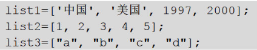
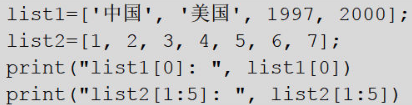
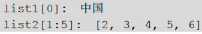
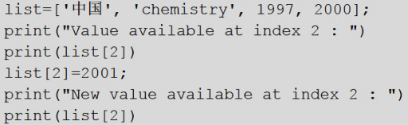
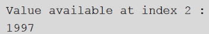
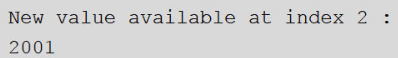
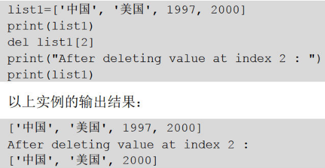
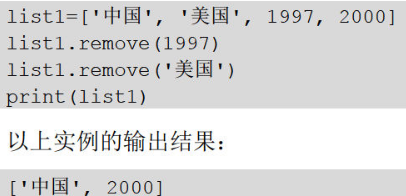
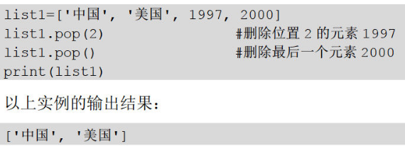

## 1.python 数据类型

**数值类型**

int：整型，**python3中无long类型**

float：浮点型，**可用科学计数法表示（2.78E2=2.78×10\^2）**

complex:复数，可用a+bj或complex(a,b)表示，**虚部通常以j或J结尾**

**字符串**

python不支持字符类型，**单字符在python里也是一个字符串，使用单双引号表示字符串是一样的**

**布尔类型**

只有True和False两种类型，但是布尔类型有以下几种运算

and（与），or（或），not（非）

**布尔类型可以与其它数据类型做and，or，not运算，进行运算时，下面的几种情况会被认为是False**

**(1)为0的数字，包括0、0.0**

**(2)表示空值的None**

**(3)空集合，包括空元组（）、空序列[]、空字典{}**

**空值**

**用None表示，不支持任何运算，也没有内置函数方法，None和任何其他数据类型比较永远返回False，在python中未指定返回值的函数会自动返回None**

## 2.序列数据结构

数据结构是计算机存储、组织数据的方式，序列是python中最基本的数据结构。**序列中的每个元素都分配一个数字，即它的位置或索引**，第1个索引是0，第2个索引是1，依此类推。**序列可以进行的操作包括索引、截取（切片）、加、乘、成员检查。**

python内置序列类型最常见的是列表、元组和字符串。此外，python提供了**字典和集合这样的数据结构，属于无顺序的数据集合体**，不能通过位置索引来访问数据元素。

**列表**

列表（List）是最常用的python数据类型，**列表的数据项不需要具有相同的类型**，列表类似于其他语言的数组，但功能要比数组强大的多。

**创建一个列表，只要把逗号分隔的不同数据项使用方括号括起来即可**

(1)访问列表中的值

**使用下标索引来访问列表中的值**，同样可以**使用方括号的形式截取字符**

(2)更新列表

可以对列表中的数据项进行修改或更新

(3)删除列表元素

方法一，**使用del语句**

方法二，**使用remove（）方法**

方法三，**使用pop（）方法来删除列表中指定位置的元素，无参数时删除最后一个元素**

