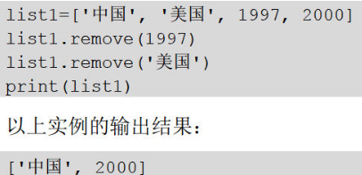
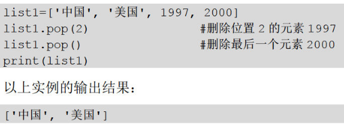
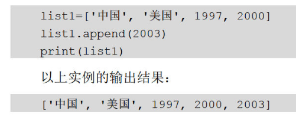
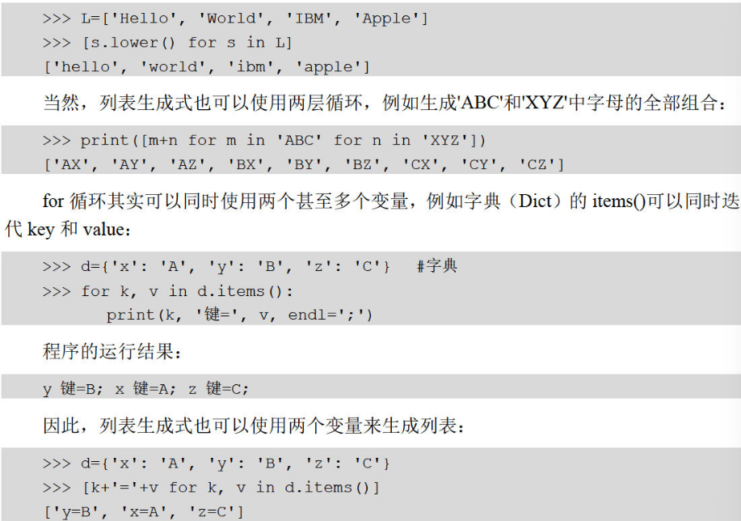

# 2.序列数据结构

数据结构是计算机存储、组织数据的方式，序列是python中最基本的数据结构。**序列中的每个元素都分配一个数字，即它的位置或索引**，第1个索引是0，第2个索引是1，依此类推。**序列可以进行的操作包括索引、截取（切片）、加、乘、成员检查。**

python内置序列类型最常见的是列表、元组和字符串。此外，python提供了**字典和集合这样的数据结构，属于无顺序的数据集合体**，不能通过位置索引来访问数据元素。

**列表**

列表（List）是最常用的python数据类型，**列表的数据项不需要具有相同的类型**，列表类似于其他语言的数组，但功能要比数组强大的多。

**创建一个列表，只要把逗号分隔的不同数据项使用方括号括起来即可**

(1)访问列表中的值

**使用下标索引来访问列表中的值**，同样可以**使用方括号的形式截取字符**

(2)更新列表

可以对列表中的数据项进行修改或更新

(3)删除列表元素

方法一，**使用del语句**

方法二，**使用remove（）方法**

方法三，**使用pop（）方法来删除列表中指定位置的元素**，无参数时删除最后一个元素

(4)添加列表元素

**使用append（）在列表的末尾**添加元素

(5)定义多维列表

可以将多维列表视为列表的嵌套，即多维列表的元素值也是一个列表，只是维度比父列表小一。三维列表的元素值是二维列表

列表生成式是Python内置的一种生成列表的表达式

再如，把一个列表中的所有字符串变成小写模式：

